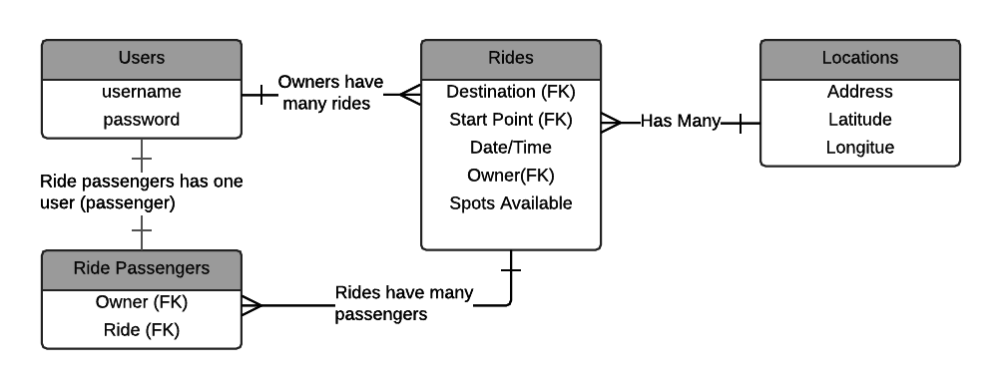

###RideShare

##Links
* [Deployed Front End](http://raq929.github.io/ride-share-front-end/)
* [Deployed Back End](https://glacial-atoll-7078.herokuapp.com)
* [Back End Repo](https://github.com/raq929/ride-share)

##Technologies used

###No straps attached! (HTML5/CSS3)
I decided not to use Bootstrap or other template for this project, and designed my own CSS. There were several tools that helped me a lot with this. 

* [Button Generator](http://www.bestcssbuttongenerator.com/) 
* [Box Shadow Generator](http://css3gen.com/box-shadow/)
* [Grid generator](http://www.responsivegridsystem.com/calculator/)

###Handlebars
I used handlebars extensively in this project to generate the rides list and the edit form. This was my first time really using the logic in handlebars, which allowed me to show different information based on whether or not a user is logged in, and whether they are a passenger or driver. It allowed for a customizable experience.

###jQuery
jQuery was at the heart of this project; it was the driving force in making my app work, and it helped me fill in forms and create the bulk of the app's functionality.

###Models
I decided not to use Ember for this project, because it didn't seem right for a one-page app like this one. However, I wanted some of the functionality that I saw when I was learning Ember. So I created a rides constructor function with a variety of methods on it, so that I could easily manipulate the rides data. I also created an object to store the state of the screen, so that I could refresh the rides list without changing the user's view.
It was not within she scope of this project, but I eventually want to add an auto-refresh to this app so that new rides are automatically added to user's rides list. 

###Mapbox
I used [Mapbox](https://www.mapbox.com/) for the map functionality of this app. It uses Leaflet to create the maps and layers. I learned a lot about how layers work as I learned this technology, and I had a lot of fun manipulating the map. 

##My Approach

###Planning
I started out by creating user stories, and a wireframe for the app. I also created a plan for my database that cataloged the columns of my tables and the relationships between them. I then made a basic front-end without any styling, so that I could have an idea of how I wanted my information displayed. I also spent some time playing with MapBox as a proof of concept before I started to write a lot of code. 

###Ruby on Rails
After the planning phase, I wrote my backend in Ruby on Rails.  I loved returning to Ruby for this project, and I had the opportunity to explore more complex relationships between my tables and more extensive serializers, which was a lot of fun. 

###Front-end
After completing the backend, I moved on to the client side. I first did login and registration, then I wrote a handlebars template to display the rides. After that I moved on to creating, editing and deleting rides and passengers. I made a model for rides so that I could easily manipulate data based on the user, and also a model that saves the view state, so that users can join a ride without loosing their view state when the rides list refreshes. Finally, I added more styles, and added features to improve useablity. 

###Planning documents

* [User Stories](https://docs.google.com/document/d/1H0jIs4mJxUaECFkKBjgEUvmAuhjs1xXskIu1tnxFyMY/edit?usp=sharing)

* ERD

###Major Hurdles
* Figuring out MapBox was definitely a difficult part of this app. Figuring out exactly what a layer is and how to manipulate it was a major breakthrough. 

###What's next?
* My first priority to improve this app is to make rides sortable by date, so that if the drive has already happened, it's not displayed. 
* Pop-ups for starting address 
* Chat functionality so that users can talk to each other without email.
* Usernames to protect email addresses of users. 

